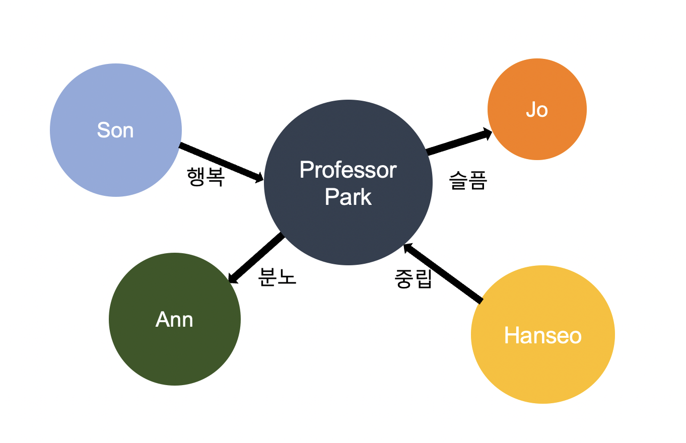
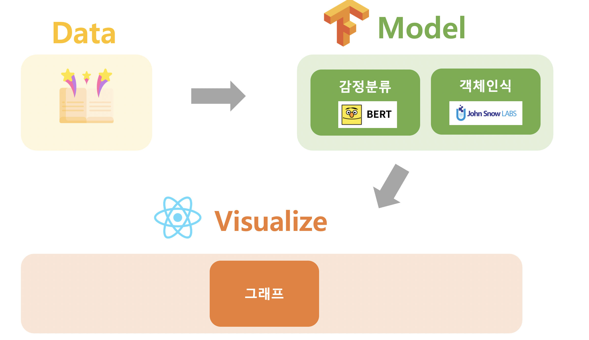

# PeekABook  
#AI #NLP
2021 Sangmyung Univ. graduation project  
TEAM 전손조베이비  
  
  2021 상명대학교 1학기 캡스톤디자인 경진대회 공과대학 우수작품상(장려상)  
  2021 상명대학교 소프트웨어학과 졸업작품 심사 1등  
    
      
      
### Introduction  
  

 
  Peek a boo, 즉 까꿍이라는 첫번째 뜻과 책을 살짝 열어본다는 두번째 의미를 가진 소설 관계도 시각화 프로젝트입니다. 작품 속의 인물 관계를 AI가 자동으로 인지해서 보여주면 좋겠다는 아이디어에서 시작했습니다. 인물간의 관계를 NLP(natural language processing)자연어처리 기술을 사용하여 지도학습으로 인공지능이 직접 감정을 파악하고, 간단한 프론트엔드와 백엔드를 구현하여 그래프 알고리즘 형태의 그림으로 시각화하였습니다. 기존에 없던 아이디어를 직접 방향성을 서치하고 구현했다는 점에서 의의가 있습니다.
   
### Process. 
  

 
  - Data  
  데이터 품질을 가장 중요시 했습니다. 저작권 만료 사이트 manybook.net에서 소설을 다운받아 한 줄씩 파싱하여 직접 읽어가며 라벨링 했습니다. 부족한 데이터양을 보완하기 위해 EDA를 차용해 문장 성분 제거, 부사어구 추가로 데이터를 증강했습니다. 책을 선정하는 데 있어서 데이터의 명확성 또한 고민 했습니다. 모호하고 복잡한 장편소설보다는 간단하고 명료한 어린이 동화를 선택하게 되었습니다.  
  - Model  
  NLP에서 강수를 보이는 GPT2, 연속성에 중점을 두어 CNN, RNN, LSTM, GRU를 고려했습니다. 많은 고민 끝에 최종적으로는 구글이 2018년에 공개한 NLP용 언어모델인 BERT의 감정특화 학습모델 SST2 Expert Model을 선정했습니다. 이 모델은 데이터의 연속성과 NLP 두 가지 장점을 모두 가지며 감정이라는 데이터에서 잘 동작하는 모델입니다.  
  객체탐지에서는 존스노우랩스의 SparkNLP 오픈소스를 사용했습니다. SparkNLP는 고급자연어처리를 위해 만들어진 오픈소스 텍스트 처리 라이브러리 입니다. NER모듈을 사용하여 사람으로 추정되는 고유명사를 뽑도록 했습니다.  
  -Visualization   
  리액트를 사용해서 웹을 만들고 D3 Javascript로 시각화 했습니다. 소설의 연속적인 속상에 맞춘 10개의 Timeline으로 나타내어지도록 만들었습니다.  
  
### Role
+ 조한희  
 2021 1학기 팀장    
 아이디어 구상  
 감정 예측 모델, NER모델 구축  

+ 손은영  
  2021 2학기 팀장  
   데이터 전처리(라벨링)  
   데이터 시각화    
   
+ 전한서  
   데이터 전처리(라벨링)  
   데이터 시각화
