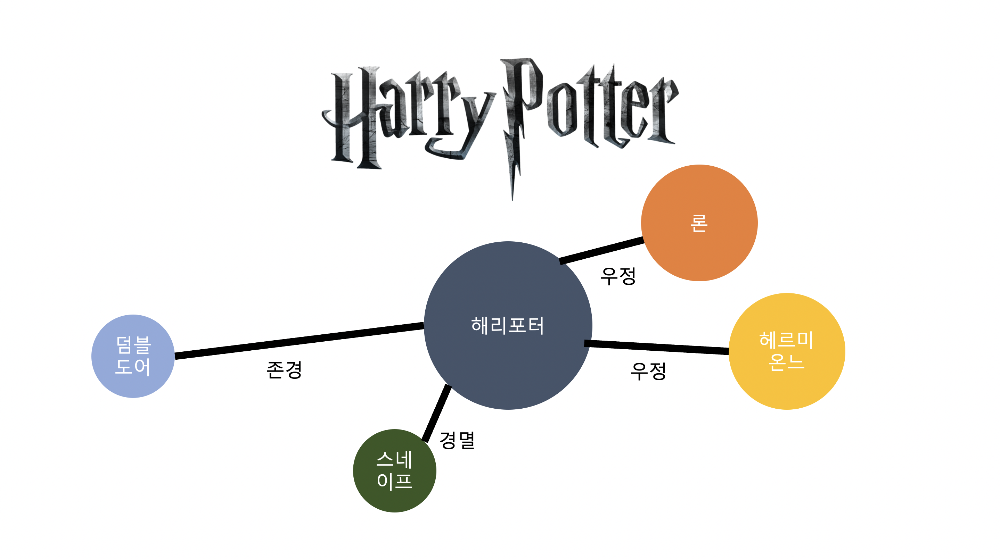

# PeekABook  
#AI #NLP
2021 Sangmyung Univ. graduation project  
TEAM 전손조베이비  
  
  2021 상명대학교 1학기 캡스톤디자인 경진대회 공과대학 우수작품상(장려상)  
  2021 상명대학교 소프트웨어학과 졸업작품 심사 1등  
    
      
      
### Introduction  
  

 
  Peek a boo, 즉 까꿍이라는 첫번째 뜻과 책을 살짝 열어본다는 두번째 의미를 가진 소설 관계도 시각화 프로젝트입니다. 작품 속의 인물 관계를 AI가 자동으로 인지해서 보여주면 좋겠다는 아이디어에서 시작했습니다. 인물간의 관계를 NLP(natural language processing)자연어처리 기술을 사용하여 지도학습으로 인공지능이 직접 감정을 파악하고, 간단한 프론트엔드와 백엔드를 구현하여 그래프 알고리즘 형태의 그림으로 나타낼 계획입니다.
   

  
### Role
+ 조한희  
 2021 1학기 팀장  
 아이디어 구상  
 감정 예측 모델, NER모델 구축  

+ 손은영
  2021 2학기 팀장
   데이터 전처리(라벨링)
   데이터 시각화  
   
+ 전한서  
   데이터 전처리(라벨링)  
   데이터 시각화
